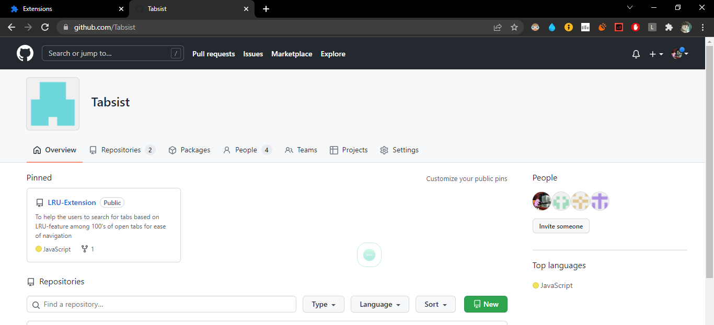
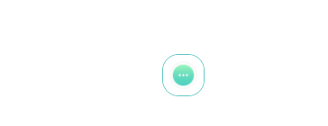
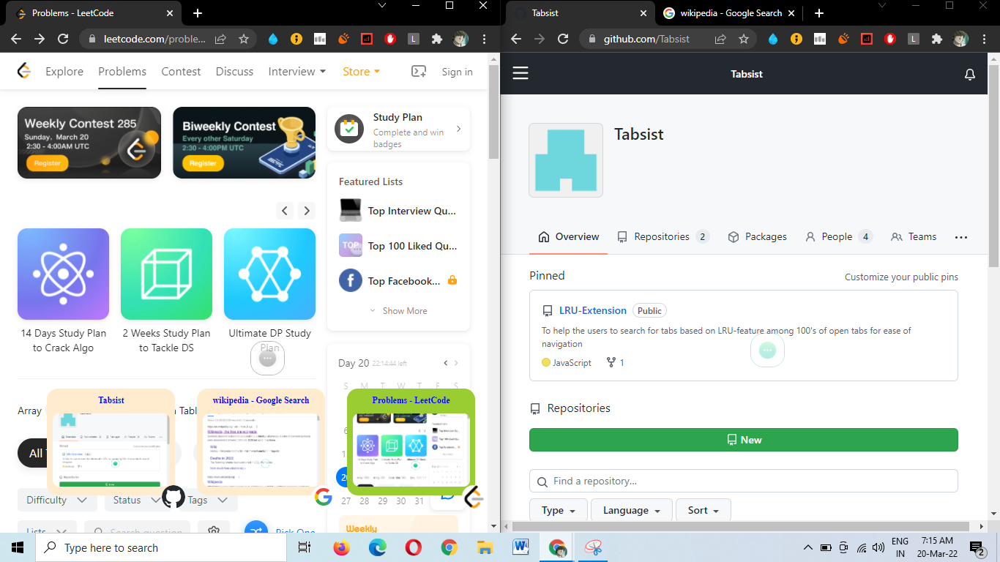
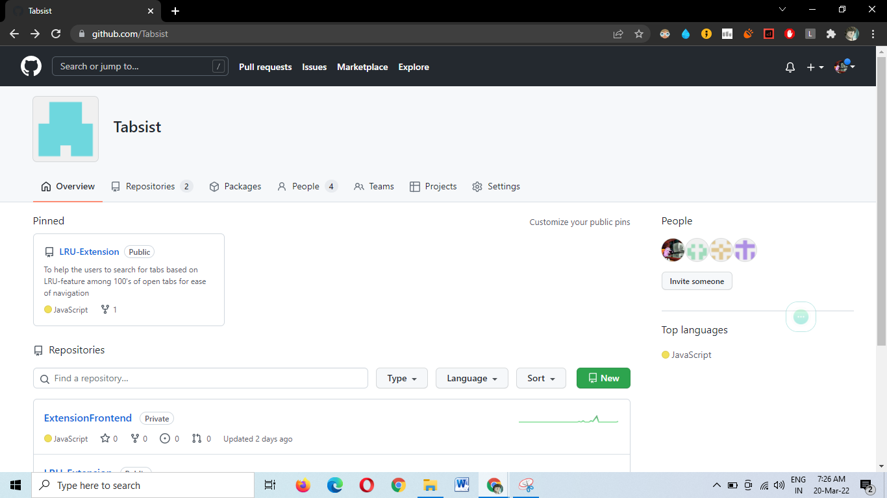
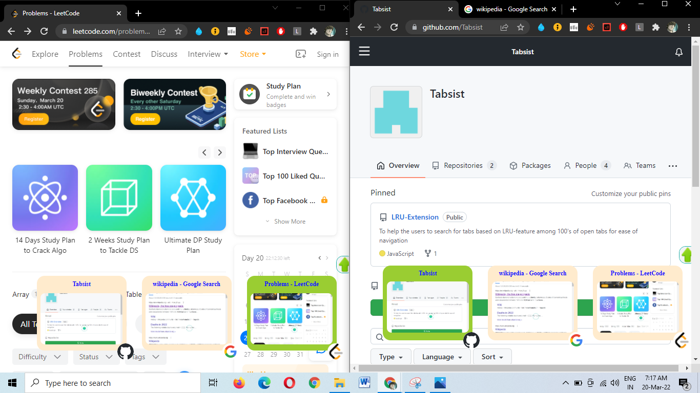

  <a href="" rel="noopener">
 

<h1 align = 'center'> Tabsist</h1>

 

  
&emsp;&emsp; 

&emsp;&emsp;&emsp;&ensp;&nbsp;

 

  <a href="" rel="noopener">

<h1 align = 'center'> 👥 Mode</h1>

  1️⃣  Download the Zip file from [this link](https://drive.google.com/drive/folders/1uK1-mVNfMkriH31m-cmoHFWvg1O69vzj)

  2️⃣  Extract the file.

  3️⃣  Head on to [Chrome Extensions](https://chrome://extensions/)

  4️⃣  Click on Load unpacked option

  5️⃣  Now select the public folder. 

  <a href="" rel="noopener">

<h1 align = 'center'> 🖱 Mode</h1>

  1️⃣  Clone the repo or Download the Zip file.

  2️⃣  Run [npm](https://www.npmjs.com/) install

<h3 align="center"> The silent look of the icon 😎 (right in the middle) </h3>
 

  

 

<h3 align="center"> Focused view 🕶 </h3>
 

  

 

<h3 align="center"> Preview with multiple chrome windows  </h3>
 

  

 

<h3 align="center"> If center is not comfortable position for the icon, sliding it ⏮ ⏭ is an option  </h3>
 

  

 

<h3 align="center"> Accessible in each chrome window/chrome tab seperately   </h3>
 

  

 
  
  
###             Tech stack
`Backend` : Javascript  
`Database` : Chrome Local Storage  
`Frontend` : ReactJS , CSS , HTML , Javascript   

    
 ------------------------------------------

### Contributors

- [@Neeraj Naik](https://github.com/NeerajNaik)
- [@Vatsal Pathak](https://github.com/vatsal003)
- [@Sanmit Sahu](https://github.com/sanmitsahu)
- [@Vinit Mundra](https://github.com/vmundra)
