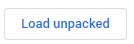

<p align="center">
  <a href="" rel="noopener">
 
</p>
<h1 align = 'center'> Tabsist</h1>

<br>

&emsp;&emsp; [](https://developer.mozilla.org/en-US/docs/Web/JavaScript)

[](https://reactjs.org/docs/getting-started.html)


<br>

<p align="center">
  <a href="" rel="noopener">
</p>
<h1 align = 'center'> 👥 Mode</h1>


  1️⃣   [Link to the zip file](https://drive.google.com/drive/folders/1uK1-mVNfMkriH31m-cmoHFWvg1O69vzj), download the file

  2️⃣  Extract the file.

  3️⃣  Head on to [Chrome Extensions](https://chrome://extensions/)

  4️⃣  Click on Load unpacked option
<p>
 
</p>

  5️⃣  Now select the public folder. 
  
<p align="center">
  <a href="" rel="noopener">
</p>
<h1 align = 'center'> 🖱 Mode</h1>

  1️⃣  Clone the repo or Download the Zip file.

  2️⃣  Run [npm](https://www.npmjs.com/) install
  
  3️⃣  In your code-editor type the command
  
```
      npm run dev
      
```


<div align="center">
<h3 align="center"> The silent look of the icon 😎 (right in the middle) </h3>
<br>
<p align="center">
  
</p>
<br>

<h3 align="center"> Focused view 🕶 </h3>
<br>
<p align="center">
  
</p>
<br>


<h3 align="center"> Preview with multiple chrome windows  </h3>
<br>
<p align="center">
  
</p>
<br>


<h3 align="center"> If center is not comfortable position for the icon, sliding it ⏮ ⏭ is an option  </h3>
<br>
<p align="center">
  
</p>
<br>


<h3 align="center"> Accessible in each chrome window/chrome tab seperately   </h3>
<br>
<p align="center">
  
</p>
<br>
</div>  
  
###             Tech stack
`Backend` : Javascript <br>
`Database` : Chrome Local Storage <br>
`Frontend` : ReactJS , CSS , HTML , Javascript  <br>

    
 ------------------------------------------

### Contributors

- [@Neeraj Naik](https://github.com/NeerajNaik)
- [@Vatsal Pathak](https://github.com/vatsal003)
- [@Sanmit Sahu](https://github.com/sanmitsahu)
- [@Vinit Mundra](https://github.com/vmundra)
