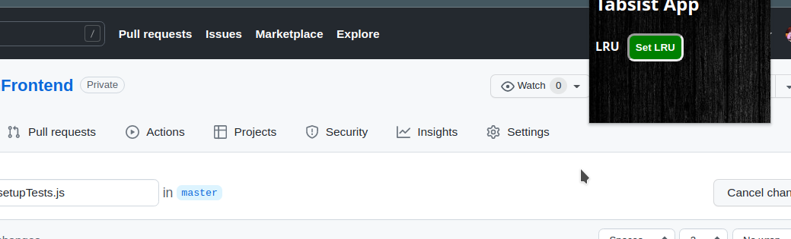

# LRU-Extension 
### (The feature is still in the building phase)

##  To run locally 
1)  Clone the repo
2)  run (npm install), to install node-modules
3)  run (npm run build:extension) first, to create the build
4)  and then unpack the build in chrome://extensions

###  Icon...

###  Preview of the recently visited/opened tabs by the user

###  This is what it looks like exactly

###  Toggle the feature

